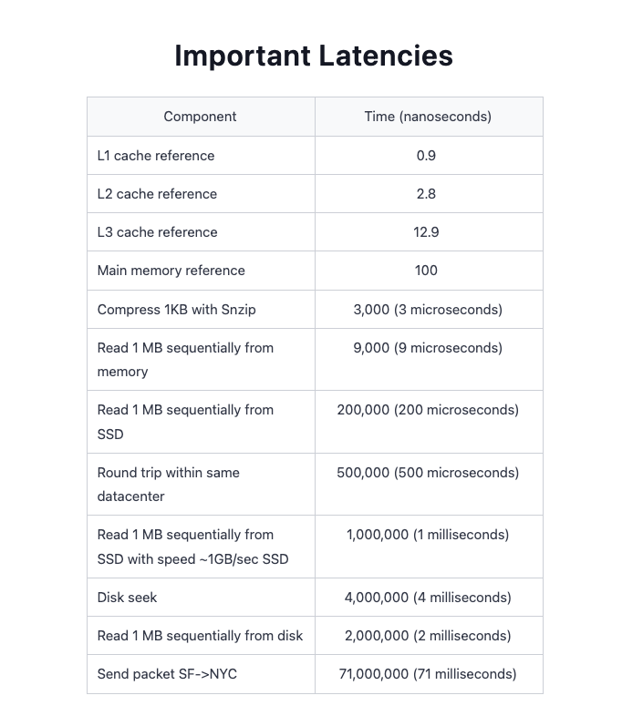
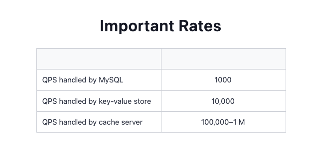

Back-of-the-envelope calculations (BOTECs) involve swift, approximate, and simplified estimations or computations typically done on paper or, figuratively, on the back of an envelope.

A modern system is a complex web of computational resources connected via a network. Different kinds of nodes, such as load balancers, web servers, application servers, caches, in-memory databases, and storage nodes, collectively serve the clients. Such a system might be architected in different ways, including a monolithic architecture, a modular monolith architecture, or a microservices architecture. Precisely considering such richness at the design level (especially in an interview) isn’t advisable, and sometimes, it’s impossible. BOTECs help us ignore the nitty-gritty details of the system (at least at the design level) and focus on more important aspects, such as finding the feasibility of the service in terms of computational resources.

Some examples where we often need BOTECs are the following estimations:

The number of concurrent TCP connections a server can support

The number of requests per second (RPS) a web, database, or cache server can handle

The storage requirements of a service.

Types of data center servers
Data centers don’t have a single type of server. Enterprise solutions use commodity hardware to save costs and develop scalable solutions. Below, we discuss the types of servers that are commonly used within a data center to handle different workloads.

Web Servers
For scalability, web servers are decoupled from application servers. Web servers are the first point of contact after load balancers. Data centers have racks full of web servers that usually handle API calls from clients. Depending on the service that’s offered, the memory and storage resources in web servers can be small to medium. However, such servers require good processing resources. For example, Facebook has used a web server with 32 GB of RAM and 500 GB of storage space in the past.

Application servers
Application servers run the core application software and business logic. The difference between web servers and application servers is somewhat fuzzy. Application servers primarily provide dynamic content, whereas web servers mostly serve static content to the client. They can require extensive computational and storage resources. Storage resources can be volatile and nonvolatile. Facebook has used application servers with a RAM of up to 256 GB and two types of storage—traditional rotating disks and flash—with a capacity of up to 6.5 TB.

**Storage servers**
With the explosive growth of Internet users, the amount of data stored by giant services has multiplied. Additionally, various types of data are now being stored in different storage units. For instance, YouTube uses the following data stores:

* Blob storage: This is used for its encoded videos.

* Temporary processing queue storage:

* Bigtable: This is a specialized storage used for storing a large number of thumbnails of videos.

* Relational database management system (RDBMS): This is for users’ and videos’ metadata (comments, likes, user channels, and so on).

Note: The servers described above aren’t the only types of servers in a data center. Organizations also require servers for services like configuration, monitoring, load balancing, analytics, accounting, caching, and so on.

We should know that doing IO-bound work (for example, reading 1 MB data sequentially from the SSD disk) is two orders of magnitude slower than CPU-bound work (for example, compressing 1 KB data as snzip).

As long as the data to compress is readily available to the processor from L1, L2, or L3 caches, the time to compress will be relatively consistent. The data up to the size of the L3 cache of the server (which is normally a few MBs—45 MBs for a typical server, as mentioned above) fits entirely within the cache, and therefore, compressing data up to this limit will take almost the same time. This is because the processor can quickly access the data from the cache without incurring the additional latency associated with fetching data from slower levels of memory or storage.

Apart from the latencies listed above, throughput numbers are measured as queries per second (QPS) that a typical single-server datastore can handle.

**Request types**
* Workloads (clients’ requests) can be broadly classified into three categories: CPU-bound, memory-bound, and IO-bound.

* CPU-bound requests: These primarily depend on the processor of a node. An example of a CPU-bound request is compressing 1 KB of data as snzip. From the table above, we see that this operation takes 3 microseconds.

* Memory-bound requests: These are primarily bottlenecked by the memory subsystem. An example is reading 1 MB of data sequentially from the RAM of a node. From the table above, we see that such an operation takes 9 microseconds (that’s three times slower than a CPU-bound operation!).

* IO-bound requests: These are primarily bottlenecked by the IO subsystem (such as disks or the network). An example is reading 1 MB of data sequentially from a disk. From the table above, we see that such an operation takes 200 microseconds (a whopping 66 times slower than CPU-bound operations!)

Similar to BOTECs, we can say that if a CPU-bound request takes X time units to complete some work on a node, then memory-bound workloads are an order of magnitude slower (10X), and IO-bound workloads are two orders of magnitude slower (100X) than the CPU-bound workload. We do such simplifications to make any further calculations easier.

**Resource Estimation**
* Number of servers required
  1. DAU(daily active users): There are 500 million (M) daily active users (DAU).

  2. Requests per day: A single user makes 20 requests per day on average.

  3. Requests per server: We know that a single server (with 64 cores) can handle 64000 RPS (Requests per server)

* Peak capacity
We can get an estimate for the peak capacity. We assume that there’s a specific second in the day when all the requests of all the users arrive at the service simultaneously.
If our assumption is correct that all of the workloads can show up simultaneously in a specific second and each of our servers can handle 64,000 requests per second, we’ll need the astronomical count of 157K servers! If that’s not feasible, then we have two potential paths forward now,
  1. Improving the RPS of a server:
  There are many examples where organizations relied on extensive engineering to improve the RPS of servers. If we think our assumption for the peak load is correct, we can work out how many servers at max we can commission.

  2. Improving over the peak load assumption
  The second choice for us is to change our assumption for the peak load. Using the Pareto principle, also known as the 80/20 rule, estimating peak traffic can be a reasonable approach in many cases. The Pareto principle suggests that approximately 80% of the effects come from 20% of the causes. In the context of estimating peak traffic, we can make the assumption that 80% of our peak traffic occurs within 20% of the time.(a 4.8-hour window in 24 hours). If the load gets higher than we predict, techniques like load-shedding, circuit-breakers, and throttling can be employed.

**Cost of servers**
**Storage Requirements**
**Bandwidth Requirements**

**References**
* https://www.educative.io/courses/grokking-modern-system-design-interview-for-engineers-managers/examples-of-resource-estimation
