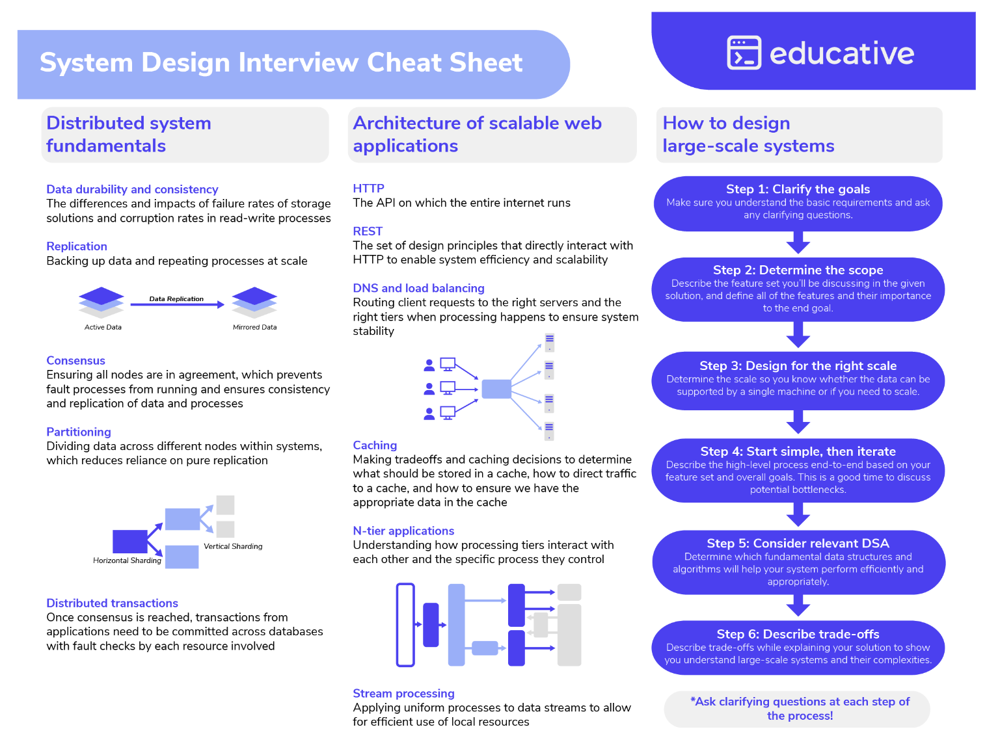

**System Design**
  * Step 1 - Clarify Requirements

        Start with easy and obvious questions

  * Step 2 - Determine the scope

        Try and figure out the scale of the system (users, clients, storage, network, bandwidth, …)

  * Step 3 - System interface definition

        Define what API’s are expected from the system

  * Step 4 - Defining the data model

        Defining the data model will clarify how data will flow between different system components which will be a guide data partitioning and management.

        Entities should be defined, how they interact, storage, transportation, encryption, …

        What database? MySql, or Nosql like Cassandra

  * Step 5 - High level design

  * Step 6 - Detailed design

  * Step 7 - Identifying and resolving bottle necks

  * Are there any single point of failures in our system?

  * Monitoring performance?alerts?

  * Enough replicas?

  * Enough servers?

**References**
* https://www.educative.io/blog/complete-guide-to-system-design

* https://www.educative.io/blog/complete-guide-system-design-interview

* https://www.educative.io/blog/how-to-prepare-system-design-interview

* https://www.educative.io/courses/grokking-modern-system-design-interview-for-engineers-managers/introduction-to-modern-system-design